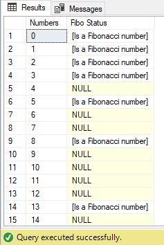
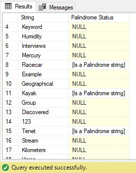
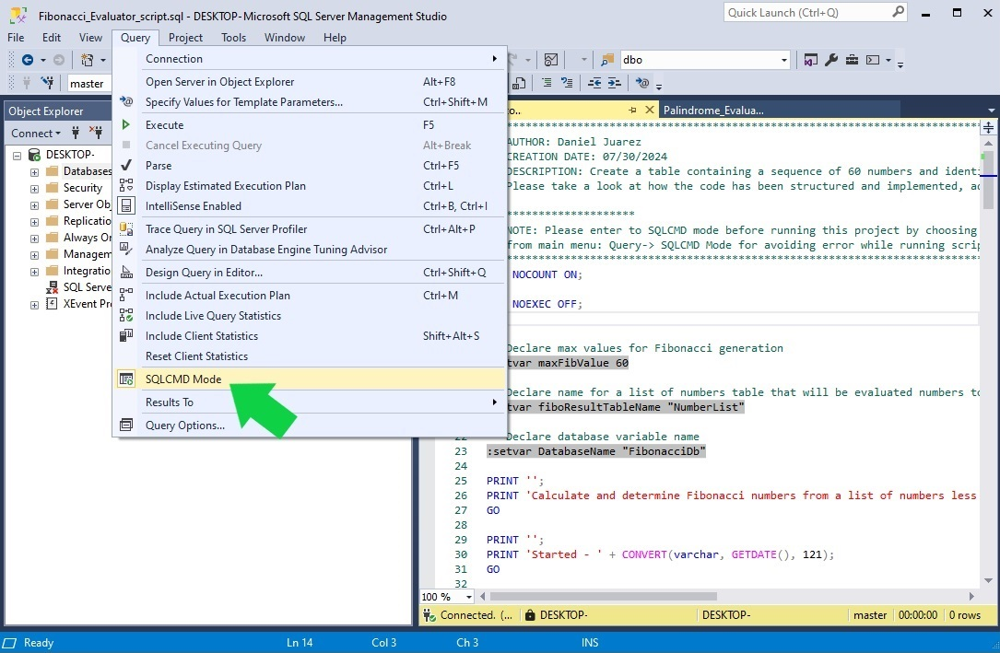

# Microsoft SQL Scripts Demo
This repo contains the following MS-SQL scripts demo:

## Fibonacci Numbers Evaluator script
This MS-SQL script evaluates the [Fibonacci sequence](https://en.wikipedia.org/wiki/Fibonacci_sequence) up to a number specified in the variable `maxFibValue`. This script will generate and display a sequence of consecutive numbers and in an adjacent column will indicate whether it is a Fibonacci number. <br/>

Filename:
```txt
Fibonacci_Evaluator_script.sql
```
Result: <br/>


## Palindrome Strings Evaluator script
This MS-SQL script evaluates which strings are [Palindrome symbols](https://en.wikipedia.org/wiki/Palindrome) from a list of `strings` provided in the script and generates and displays a list indicating in an adjacent column `Palindrome Status` which of them are `Palindrome Strings`.<br/>

Filename:
```txt
Palindrome_Evaluator_script.sql
```
Result: <br/>



### Additional Information
To run these scripts containing script variables (`:setvar`) in your [SSMS](https://learn.microsoft.com/en-us/sql/ssms/download-sql-server-management-studio-ssms) environment, you should first enable `SQLCMD Mode` as shown in the following screenshot:



### Note:
Please note that even if these scripts generate their own databases, tables, temporary tables, user-defined functions and then clean them up after execution is complete, be mindful that you should `run` these scripts in an isolated SQL server environment.
